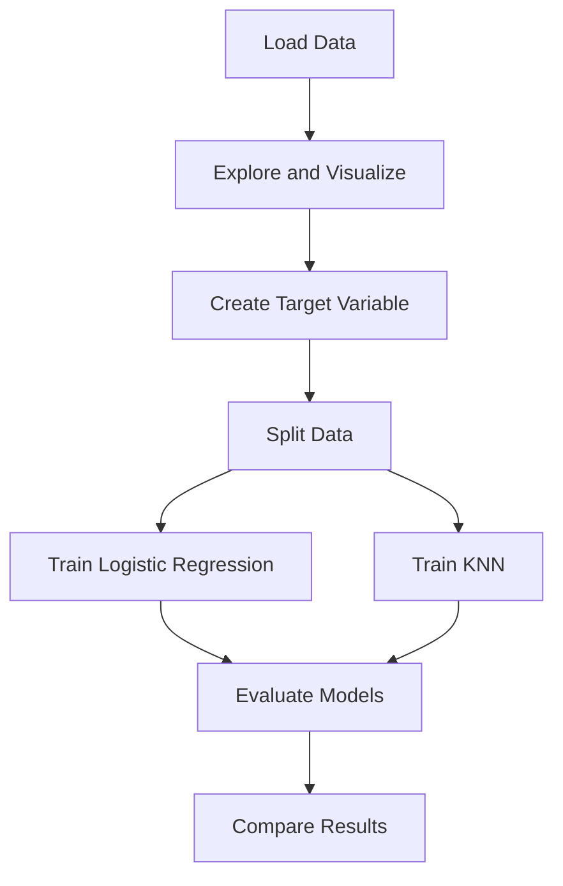

# boston-crime-prediction
This project uses machine learning classification models to predict whether neighborhoods in Boston exceed the median crime rate per capita, based on the Boston Housing dataset. Key features include CRIM, ZN, INDUS, CHAS, NOX, and others, with Logistic Regression and KNN applied to classify the outcome.

